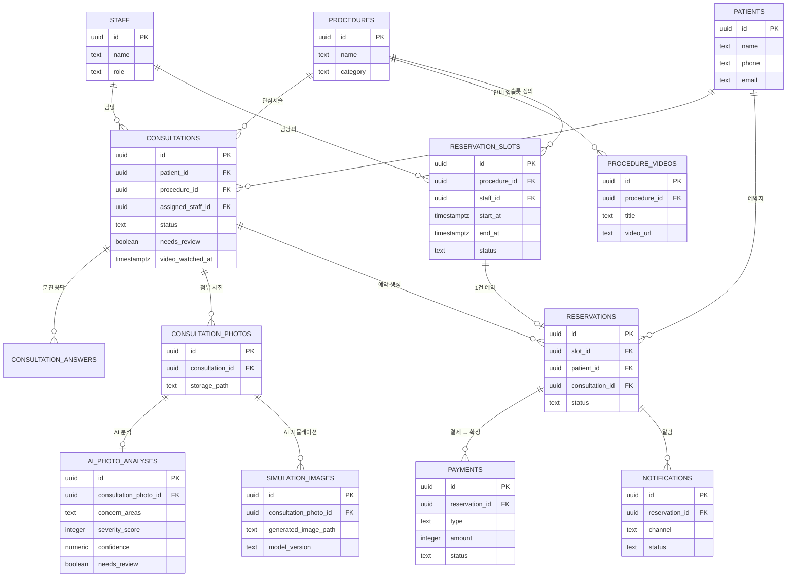

# 데이터베이스 스키마 설계 (PostgreSQL / Supabase)

| 항목 | 내용 |
|---|---|
| 문서 상태 | Draft v0.4 |
| 작성일 | 2026-09-05 |
| DB | PostgreSQL 15+ (Supabase) |

관련 문서: [prd.md](../prd.md), [TECH_STACK.md](TECH_STACK.md)

> **현재 운영 범위**: `procedures`는 **Face Lift(안면거상술) 단일 행**만 보유하고(세부 프로그램 구분 없음), `staff`의 `role = 'doctor'` 행은 **박동만** 1건만 존재하는 것을 전제로 시드 데이터를 구성한다. 스키마 자체는 시술·원장이 늘어나도 그대로 확장 가능하도록 범용으로 유지한다.
>
> **예약 확정 원칙**: 환자-원장 채팅은 범위에서 제외되었고(전화 응대로 대체), 예약은 **결제가 완료되어야만 확정**된다. `reservations.status`에 `pending_payment`를 두어 이 흐름을 표현한다.
>
> **AI 기능 원칙**: `ai_photo_analyses`(사진 분석)와 `simulation_images`(가상 시뮬레이션)는 모두 **참고 자료**이며 의료 기록이 아니다. 최종 진단은 방문 상담에서 원장이 내리므로, 이 테이블들의 값은 절대 `consultations`나 `reservations`의 확정 상태를 자동으로 바꾸지 않는다 (단, 신뢰도 낮음/이상 소견 플래그만 원장 알림으로 연결).
>
> **상담사 계정 없음**: `staff.role`은 `admin`(관리자) \| `doctor`(원장) 두 가지만 사용한다. AI 확인 필요 건의 전화 후속 응대를 포함해 모든 임상 대응은 원장 1인이 직접 수행한다.

---

## 1. ER 다이어그램 (개요)



---

## 2. 테이블 정의

### 2.1 `patients` (환자)
| 컬럼 | 타입 | 설명 |
|---|---|---|
| id | uuid PK | Supabase Auth user id와 연동 |
| name | text | 이름 |
| phone | text | 연락처 (본인인증 대상, unique) |
| email | text | 이메일 (선택) |
| birth_date | date | 생년월일 (선택) |
| gender | text | 선택 |
| marketing_opt_in | boolean | 마케팅 수신 동의 |
| created_at | timestamptz | 가입일 |

### 2.2 `staff` (관리자/원장)
| 컬럼 | 타입 | 설명 |
|---|---|---|
| id | uuid PK | Supabase Auth user id와 연동 |
| name | text | 이름 |
| role | text | `admin` \| `doctor` |
| phone | text | 내부 연락처 (전화 응대에 사용) |
| is_active | boolean | 재직 여부 |
| created_at | timestamptz | |

### 2.3 `procedures` (시술 항목)
| 컬럼 | 타입 | 설명 |
|---|---|---|
| id | uuid PK | |
| category | text | 예: Face Lift |
| name | text | 시술명 |
| base_price | integer | 기준 시술비 (원) |
| deposit_amount | integer | 예약금 (기본 50,000원 고정) |
| questionnaire_template_id | uuid FK | 이 시술의 문진표 템플릿 |
| is_active | boolean | 노출 여부 |

### 2.4 `questionnaire_templates` / `questionnaire_fields` (문진표 템플릿)
| 테이블 | 컬럼 | 설명 |
|---|---|---|
| questionnaire_templates | id, name, procedure_category | 카테고리별 문진표 묶음 |
| questionnaire_fields | id, template_id FK, label, field_type, options(jsonb), is_required, sort_order | 개별 질문 항목 (관리자가 편집 가능하도록 동적 구조) |

### 2.5 `procedure_videos` (시술 안내 영상)
| 컬럼 | 타입 | 설명 |
|---|---|---|
| id | uuid PK | |
| procedure_id | uuid FK → procedures | |
| title | text | 예: "Face Lift 과정 안내" |
| video_url | text, nullable | 영상 파일 URL (Storage `procedure-media` 버킷). 아직 업로드 전이면 null — 환자 화면은 미리보기 시뮬레이션으로 대체 표시 |
| duration_sec | integer | 영상 길이(초) |
| is_active | boolean | 노출 여부 |
| sort_order | integer | 여러 개 등록 시 노출 순서 |

### 2.6 `procedure_steps` (시술 진행 과정 단계)
| 컬럼 | 타입 | 설명 |
|---|---|---|
| id | uuid PK | |
| procedure_id | uuid FK → procedures | |
| step_order | integer | 진행 순서 (1~7), `(procedure_id, step_order)` unique |
| title | text | 단계명 (예: "디자인", "절개") |
| description | text | 단계 설명 |
| media_url | text, nullable | 첨부 사진/영상 URL (Storage `procedure-media` 버킷) |
| media_type | text, nullable | `image` \| `video` |
| updated_at | timestamptz | |

### 2.7 `consultations` (상담 신청)
| 컬럼 | 타입 | 설명 |
|---|---|---|
| id | uuid PK | |
| patient_id | uuid FK → patients | |
| procedure_id | uuid FK → procedures | 관심 시술 |
| assigned_staff_id | uuid FK → staff, nullable | 담당 직원(관리자/원장) |
| status | text | `pending`(대기) \| `needs_review`(AI 확인필요) \| `in_progress`(응대중) \| `reserved`(예약완료) \| `cancelled`(취소) |
| source | text | `web` \| `app` |
| video_watched_at | timestamptz | 시술 안내 영상 시청 완료 시각 (nullable) |
| created_at | timestamptz | |
| updated_at | timestamptz | |

### 2.8 `consultation_answers` (문진표 응답)
| 컬럼 | 타입 | 설명 |
|---|---|---|
| id | uuid PK | |
| consultation_id | uuid FK → consultations | |
| field_id | uuid FK → questionnaire_fields | |
| answer_text | text | 응답 값 (선택형은 옵션 라벨 저장) |

### 2.9 `consultation_photos` (첨부 사진)
| 컬럼 | 타입 | 설명 |
|---|---|---|
| id | uuid PK | |
| consultation_id | uuid FK → consultations | |
| storage_path | text | Supabase Storage 경로 |
| uploaded_at | timestamptz | |

> 민감정보이므로 Storage 버킷은 비공개(private) + RLS로 본인/관리자/원장만 접근하도록 서명 URL 발급.

### 2.10 `ai_photo_analyses` (AI 사진 분석 결과)
| 컬럼 | 타입 | 설명 |
|---|---|---|
| id | uuid PK | |
| consultation_photo_id | uuid FK → consultation_photos, unique | 분석 대상 사진 (사진 1장당 분석 1건) |
| concern_areas | text[] | 예: `{턱선 처짐, 목주름}` |
| severity_score | integer | 0~100 처짐 정도 점수 |
| severity_label | text | 예: `mild` \| `moderate` \| `severe` |
| confidence | numeric(4,3) | 모델 신뢰도 (0~1) |
| needs_review | boolean | 신뢰도 낮음/이상 소견 시 `true` → 원장에게 플래그 알림 |
| model_name | text | 사용된 AI 모델/버전 |
| raw_result | jsonb | 모델 원본 응답 (감사/재현용) |
| created_at | timestamptz | |

> `needs_review = true`가 되면 애플리케이션이 `consultations.status`를 `needs_review`로 갱신하고 원장에게 내부 알림을 발송한다 (PRD FR-2.2).

### 2.11 `simulation_images` (AI 가상 시뮬레이션)
| 컬럼 | 타입 | 설명 |
|---|---|---|
| id | uuid PK | |
| consultation_photo_id | uuid FK → consultation_photos | 원본 사진 (한 사진에 여러 버전 생성 가능) |
| generated_image_path | text | 생성된 Before/After 이미지 Storage 경로 |
| model_name | text | 사용된 생성 모델/서비스명 |
| disclaimer_shown | boolean | 고지문 노출 여부 기록 (컴플라이언스 증빙용) |
| created_at | timestamptz | |

> 생성 이미지는 비공개 Storage에 원본 사진과 동일한 접근 정책으로 저장. 이미지 자체에도 "AI 예상 이미지" 워터마크 삽입을 권장 (PRD FR-2.5).

### 2.12 `reservation_slots` (예약 가능 슬롯)
| 컬럼 | 타입 | 설명 |
|---|---|---|
| id | uuid PK | |
| procedure_id | uuid FK → procedures, nullable | 특정 시술 전용 슬롯인 경우 |
| staff_id | uuid FK → staff | 담당의(원장) |
| start_at | timestamptz | |
| end_at | timestamptz | |
| status | text | `open`(예약가능) \| `held`(결제 대기 중 임시선점) \| `booked`(결제완료·예약확정) \| `blocked`(휴진 등) |
| created_by | uuid FK → staff | 슬롯 등록자(관리자) |

### 2.13 `reservations` (예약)
| 컬럼 | 타입 | 설명 |
|---|---|---|
| id | uuid PK | |
| slot_id | uuid FK → reservation_slots, unique | 슬롯 1:1 매칭 (이중예약 방지) |
| consultation_id | uuid FK → consultations | |
| patient_id | uuid FK → patients | |
| status | text | `pending_payment`(결제대기) \| `confirmed`(확정) \| `changed` \| `cancelled` \| `completed` \| `no_show` |
| payment_deadline | timestamptz | 결제 대기 만료 시각 (예: 슬롯 선택 + 10분) |
| cancel_reason | text | nullable |
| created_at | timestamptz | |
| confirmed_at | timestamptz | 결제 성공으로 확정된 시각 |

> **상태 전이**: 슬롯 선택 → `pending_payment` 생성(슬롯 `held`) → 결제 성공 → `confirmed`(슬롯 `booked`) / 결제 실패·타임아웃 → `cancelled`(슬롯 `open` 복귀).

### 2.14 `payments` (결제)
| 컬럼 | 타입 | 설명 |
|---|---|---|
| id | uuid PK | |
| reservation_id | uuid FK → reservations | |
| type | text | `deposit`(예약금) \| `procedure_fee`(시술비) |
| amount | integer | 금액(원). 예약금은 기본 50,000 고정 |
| pg_provider | text | 예: `portone` |
| pg_transaction_id | text | PG사 거래 ID |
| status | text | `pending` \| `paid` \| `cancelled` \| `refunded` \| `failed` |
| refundable | boolean | 예약금은 기본 `false` (환불 불가 정책) |
| paid_at | timestamptz | |
| created_at | timestamptz | |

> `payments.status`가 `paid`로 전환되는 PG 웹훅/콜백을 수신하면, 애플리케이션(Edge Function)이 연결된 `reservations.status`를 `confirmed`로, `reservation_slots.status`를 `booked`로 함께 갱신한다.

### 2.15 `notifications` (알림 발송 로그)
| 컬럼 | 타입 | 설명 |
|---|---|---|
| id | uuid PK | |
| reservation_id | uuid FK → reservations, nullable | 상담 알림인 경우 consultation_id 대신 사용 가능하도록 확장 |
| consultation_id | uuid FK → consultations, nullable | |
| recipient_patient_id | uuid FK → patients, nullable | 환자 대상 알림 (내부 알림은 null) |
| recipient_staff_id | uuid FK → staff, nullable | 원장/관리자 대상 내부 알림 (AI 플래그 등) |
| channel | text | `push` \| `alimtalk` \| `sms` \| `internal` |
| template_key | text | 예: `reservation_confirmed`, `reminder_d1`, `ai_flag_review` |
| status | text | `queued` \| `sent` \| `failed` |
| sent_at | timestamptz | |

---

## 3. PostgreSQL DDL (초안)

```sql
create extension if not exists "uuid-ossp";

create table patients (
  id uuid primary key default uuid_generate_v4(),
  name text not null,
  phone text unique not null,
  email text,
  birth_date date,
  gender text,
  marketing_opt_in boolean not null default false,
  created_at timestamptz not null default now()
);

create table staff (
  id uuid primary key default uuid_generate_v4(),
  name text not null,
  role text not null check (role in ('admin', 'doctor')),
  phone text,
  is_active boolean not null default true,
  created_at timestamptz not null default now()
);

create table questionnaire_templates (
  id uuid primary key default uuid_generate_v4(),
  name text not null,
  procedure_category text not null
);

create table questionnaire_fields (
  id uuid primary key default uuid_generate_v4(),
  template_id uuid not null references questionnaire_templates(id) on delete cascade,
  label text not null,
  field_type text not null check (field_type in ('text', 'textarea', 'single_choice', 'multi_choice', 'date')),
  options jsonb,
  is_required boolean not null default false,
  sort_order integer not null default 0
);

create table procedures (
  id uuid primary key default uuid_generate_v4(),
  category text not null,
  name text not null,
  base_price integer not null default 0,
  deposit_amount integer not null default 50000,
  questionnaire_template_id uuid references questionnaire_templates(id),
  is_active boolean not null default true
);

create table procedure_videos (
  id uuid primary key default uuid_generate_v4(),
  procedure_id uuid not null references procedures(id),
  title text not null,
  video_url text,
  duration_sec integer,
  is_active boolean not null default true,
  sort_order integer not null default 0
);

create table procedure_steps (
  id uuid primary key default uuid_generate_v4(),
  procedure_id uuid not null references procedures(id),
  step_order integer not null,
  title text not null,
  description text not null,
  media_url text,
  media_type text check (media_type in ('image', 'video')),
  updated_at timestamptz not null default now()
);

create unique index idx_step_order on procedure_steps(procedure_id, step_order);

create table consultations (
  id uuid primary key default uuid_generate_v4(),
  patient_id uuid not null references patients(id),
  procedure_id uuid not null references procedures(id),
  assigned_staff_id uuid references staff(id),
  status text not null default 'pending' check (status in ('pending', 'needs_review', 'in_progress', 'reserved', 'cancelled')),
  source text not null default 'web' check (source in ('web', 'app')),
  video_watched_at timestamptz,
  created_at timestamptz not null default now(),
  updated_at timestamptz not null default now()
);

create table consultation_answers (
  id uuid primary key default uuid_generate_v4(),
  consultation_id uuid not null references consultations(id) on delete cascade,
  field_id uuid not null references questionnaire_fields(id),
  answer_text text
);

create table consultation_photos (
  id uuid primary key default uuid_generate_v4(),
  consultation_id uuid not null references consultations(id) on delete cascade,
  storage_path text not null,
  uploaded_at timestamptz not null default now()
);

create table ai_photo_analyses (
  id uuid primary key default uuid_generate_v4(),
  consultation_photo_id uuid not null unique references consultation_photos(id) on delete cascade,
  concern_areas text[] not null default '{}',
  severity_score integer check (severity_score between 0 and 100),
  severity_label text check (severity_label in ('mild', 'moderate', 'severe')),
  confidence numeric(4,3),
  needs_review boolean not null default false,
  model_name text,
  raw_result jsonb,
  created_at timestamptz not null default now()
);

create table simulation_images (
  id uuid primary key default uuid_generate_v4(),
  consultation_photo_id uuid not null references consultation_photos(id) on delete cascade,
  generated_image_path text not null,
  model_name text,
  disclaimer_shown boolean not null default true,
  created_at timestamptz not null default now()
);

create table reservation_slots (
  id uuid primary key default uuid_generate_v4(),
  procedure_id uuid references procedures(id),
  staff_id uuid not null references staff(id),
  start_at timestamptz not null,
  end_at timestamptz not null,
  status text not null default 'open' check (status in ('open', 'held', 'booked', 'blocked')),
  created_by uuid references staff(id),
  constraint valid_time_range check (end_at > start_at)
);

-- 동일 담당의·시간대 슬롯 중복 방지
create unique index idx_slot_staff_time on reservation_slots(staff_id, start_at);

create table reservations (
  id uuid primary key default uuid_generate_v4(),
  slot_id uuid not null unique references reservation_slots(id),
  consultation_id uuid not null references consultations(id),
  patient_id uuid not null references patients(id),
  status text not null default 'pending_payment' check (status in ('pending_payment', 'confirmed', 'changed', 'cancelled', 'completed', 'no_show')),
  payment_deadline timestamptz,
  cancel_reason text,
  created_at timestamptz not null default now(),
  confirmed_at timestamptz
);

create table payments (
  id uuid primary key default uuid_generate_v4(),
  reservation_id uuid not null references reservations(id),
  type text not null check (type in ('deposit', 'procedure_fee')),
  amount integer not null,
  pg_provider text,
  pg_transaction_id text,
  status text not null default 'pending' check (status in ('pending', 'paid', 'cancelled', 'refunded', 'failed')),
  refundable boolean not null default false,
  paid_at timestamptz,
  created_at timestamptz not null default now()
);

create table notifications (
  id uuid primary key default uuid_generate_v4(),
  reservation_id uuid references reservations(id),
  consultation_id uuid references consultations(id),
  recipient_patient_id uuid references patients(id),
  recipient_staff_id uuid references staff(id),
  channel text not null check (channel in ('push', 'alimtalk', 'sms', 'internal')),
  template_key text not null,
  status text not null default 'queued' check (status in ('queued', 'sent', 'failed')),
  sent_at timestamptz,
  constraint recipient_required check (recipient_patient_id is not null or recipient_staff_id is not null)
);
```

---

## 4. 주요 설계 원칙

- **이중 예약 방지**: `reservations.slot_id`를 `unique`로 걸어 동일 슬롯이 두 번 예약되지 않도록 DB 레벨에서 강제.
- **결제가 예약을 확정한다**: 슬롯 선택 시점에는 `reservations.status = 'pending_payment'`, `reservation_slots.status = 'held'`로만 잠그고, PG 결제 승인 웹훅을 받은 뒤에야 `confirmed`/`booked`로 전환한다. `payment_deadline`을 지난 미결제 건은 배치/Edge Function이 주기적으로 `cancelled` 처리하고 슬롯을 `open`으로 되돌린다.
- **AI 결과는 참고 자료로 분리 보관한다**: `ai_photo_analyses`/`simulation_images`는 `consultation_photos`에 종속된 별도 테이블로 분리해, AI 결과가 상담/예약의 확정 상태에 직접 관여하지 않도록 설계. 유일하게 연결되는 지점은 `needs_review` 플래그 → `consultations.status = 'needs_review'` 전환뿐이다.
- **예약금 정책 반영**: `procedures.deposit_amount` 기본값 50,000원 고정, `payments.refundable` 기본 `false`로 [prd.md](../prd.md)의 환불 불가 정책 반영.
- **문진표 동적 구성**: `questionnaire_templates` + `questionnaire_fields`로 시술별 질문을 관리자가 코드 수정 없이 편집 가능하도록 설계.
- **민감정보 분리**: 사진(`consultation_photos`), AI 분석/시뮬레이션 이미지는 Storage 경로만 DB에 저장하고 실제 파일은 비공개 버킷 + RLS로 접근 제어.
- **RLS(Row Level Security)**: Supabase 사용 시 `patients`는 본인 행만, `staff`는 역할에 따라 담당 상담/전체 상담에 접근하도록 정책 정의 필요 (별도 마이그레이션에서 작성).

## 5. 향후 확장 고려

- 다지점(멀티 병원) 확장 시 `clinics` 테이블을 최상위에 추가하고 전 테이블에 `clinic_id` 붙이는 구조로 확장 가능하도록 현재부터 FK 네이밍을 일관되게 유지.
- 리뷰/후기 기능 추가 시 `reviews` 테이블을 `reservations`에 연결.
- 채팅 상담을 재도입할 경우 `chat_rooms`(consultation_id 1:1) / `chat_messages`(sender_type: patient\|staff\|system) 테이블을 이전 설계대로 다시 추가.
- AI 모델 교체/A-B 테스트 대비, `ai_photo_analyses.model_name` / `simulation_images.model_name`으로 버전을 항상 기록해 결과 추적성을 유지.
