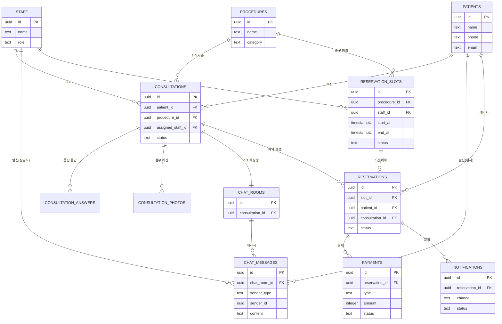

# 데이터베이스 스키마 설계 (PostgreSQL / Supabase)

| 항목 | 내용 |
|---|---|
| 문서 상태 | Draft v0.1 |
| 작성일 | 2026-09-05 |
| DB | PostgreSQL 15+ (Supabase) |

관련 문서: [prd.md](../prd.md), [TECH_STACK.md](TECH_STACK.md)

> **현재 운영 범위**: `procedures`는 **Face Lift(안면거상술) 단일 행**만 보유하고(세부 프로그램 구분 없음), `staff`의 `role = 'doctor'` 행은 **박동만** 1건만 존재하는 것을 전제로 시드 데이터를 구성한다. 스키마 자체는 시술·원장이 늘어나도 그대로 확장 가능하도록 범용으로 유지한다.

---

## 1. ER 다이어그램 (개요)



---

## 2. 테이블 정의

### 2.1 `patients` (환자)
| 컬럼 | 타입 | 설명 |
|---|---|---|
| id | uuid PK | Supabase Auth user id와 연동 |
| name | text | 이름 |
| phone | text | 연락처 (본인인증 대상, unique) |
| email | text | 이메일 (선택) |
| birth_date | date | 생년월일 (선택) |
| gender | text | 선택 |
| marketing_opt_in | boolean | 마케팅 수신 동의 |
| created_at | timestamptz | 가입일 |

### 2.2 `staff` (상담사/관리자)
| 컬럼 | 타입 | 설명 |
|---|---|---|
| id | uuid PK | Supabase Auth user id와 연동 |
| name | text | 이름 |
| role | text | `admin` \| `counselor` \| `doctor` |
| phone | text | 내부 연락처 |
| is_active | boolean | 재직 여부 |
| created_at | timestamptz | |

### 2.3 `procedures` (시술 항목)
| 컬럼 | 타입 | 설명 |
|---|---|---|
| id | uuid PK | |
| category | text | 예: 눈성형, 코성형, 안면윤곽 등 |
| name | text | 시술명 |
| base_price | integer | 기준 시술비 (원) |
| deposit_amount | integer | 예약금 (기본 50,000원 고정) |
| questionnaire_template_id | uuid FK | 이 시술의 문진표 템플릿 |
| is_active | boolean | 노출 여부 |

### 2.4 `questionnaire_templates` / `questionnaire_fields` (문진표 템플릿)
| 테이블 | 컬럼 | 설명 |
|---|---|---|
| questionnaire_templates | id, name, procedure_category | 카테고리별 문진표 묶음 |
| questionnaire_fields | id, template_id FK, label, field_type, options(jsonb), is_required, sort_order | 개별 질문 항목 (관리자가 편집 가능하도록 동적 구조) |

### 2.5 `consultations` (상담 신청)
| 컬럼 | 타입 | 설명 |
|---|---|---|
| id | uuid PK | |
| patient_id | uuid FK → patients | |
| procedure_id | uuid FK → procedures | 관심 시술 |
| assigned_staff_id | uuid FK → staff, nullable | 담당 상담사 |
| status | text | `pending`(대기) \| `in_progress`(응대중) \| `reserved`(예약완료) \| `cancelled`(취소) |
| source | text | `web` \| `app` |
| created_at | timestamptz | |
| updated_at | timestamptz | |

### 2.6 `consultation_answers` (문진표 응답)
| 컬럼 | 타입 | 설명 |
|---|---|---|
| id | uuid PK | |
| consultation_id | uuid FK → consultations | |
| field_id | uuid FK → questionnaire_fields | |
| answer_text | text | 응답 값 (선택형은 옵션 라벨 저장) |

### 2.7 `consultation_photos` (첨부 사진)
| 컬럼 | 타입 | 설명 |
|---|---|---|
| id | uuid PK | |
| consultation_id | uuid FK → consultations | |
| storage_path | text | Supabase Storage 경로 |
| uploaded_at | timestamptz | |

> 민감정보이므로 Storage 버킷은 비공개(private) + RLS로 본인/담당 상담사/관리자만 접근하도록 서명 URL 발급.

### 2.8 `reservation_slots` (예약 가능 슬롯)
| 컬럼 | 타입 | 설명 |
|---|---|---|
| id | uuid PK | |
| procedure_id | uuid FK → procedures, nullable | 특정 시술 전용 슬롯인 경우 |
| staff_id | uuid FK → staff | 담당의/상담사 |
| start_at | timestamptz | |
| end_at | timestamptz | |
| status | text | `open`(예약가능) \| `held`(임시선점) \| `booked`(예약완료) \| `blocked`(휴진 등) |
| created_by | uuid FK → staff | 슬롯 등록자(관리자) |

### 2.9 `reservations` (예약)
| 컬럼 | 타입 | 설명 |
|---|---|---|
| id | uuid PK | |
| slot_id | uuid FK → reservation_slots, unique | 슬롯 1:1 매칭 (이중예약 방지) |
| consultation_id | uuid FK → consultations | |
| patient_id | uuid FK → patients | |
| status | text | `confirmed` \| `changed` \| `cancelled` \| `completed` \| `no_show` |
| cancel_reason | text | nullable |
| created_at | timestamptz | |

### 2.10 `payments` (결제)
| 컬럼 | 타입 | 설명 |
|---|---|---|
| id | uuid PK | |
| reservation_id | uuid FK → reservations | |
| type | text | `deposit`(예약금) \| `procedure_fee`(시술비) |
| amount | integer | 금액(원). 예약금은 기본 50,000 고정 |
| pg_provider | text | 예: `portone` |
| pg_transaction_id | text | PG사 거래 ID |
| status | text | `pending` \| `paid` \| `cancelled` \| `refunded` \| `failed` |
| refundable | boolean | 예약금은 기본 `false` (환불 불가 정책) |
| paid_at | timestamptz | |
| created_at | timestamptz | |

### 2.11 `chat_rooms` / `chat_messages`
| 테이블 | 컬럼 | 설명 |
|---|---|---|
| chat_rooms | id, consultation_id FK (unique), created_at | 상담 신청 건당 1개 채팅방 |
| chat_messages | id, chat_room_id FK, sender_type(`patient`\|`staff`\|`system`), sender_id, content, attachment_url, created_at, read_at | 메시지 |

### 2.12 `notifications` (알림 발송 로그)
| 컬럼 | 타입 | 설명 |
|---|---|---|
| id | uuid PK | |
| reservation_id | uuid FK → reservations, nullable | 상담 알림인 경우 consultation_id 대신 사용 가능하도록 확장 |
| consultation_id | uuid FK → consultations, nullable | |
| recipient_patient_id | uuid FK → patients | |
| channel | text | `push` \| `alimtalk` \| `sms` |
| template_key | text | 예: `reservation_confirmed`, `reminder_d1` |
| status | text | `queued` \| `sent` \| `failed` |
| sent_at | timestamptz | |

---

## 3. PostgreSQL DDL (초안)

```sql
create extension if not exists "uuid-ossp";

create table patients (
  id uuid primary key default uuid_generate_v4(),
  name text not null,
  phone text unique not null,
  email text,
  birth_date date,
  gender text,
  marketing_opt_in boolean not null default false,
  created_at timestamptz not null default now()
);

create table staff (
  id uuid primary key default uuid_generate_v4(),
  name text not null,
  role text not null check (role in ('admin', 'counselor', 'doctor')),
  phone text,
  is_active boolean not null default true,
  created_at timestamptz not null default now()
);

create table questionnaire_templates (
  id uuid primary key default uuid_generate_v4(),
  name text not null,
  procedure_category text not null
);

create table questionnaire_fields (
  id uuid primary key default uuid_generate_v4(),
  template_id uuid not null references questionnaire_templates(id) on delete cascade,
  label text not null,
  field_type text not null check (field_type in ('text', 'textarea', 'single_choice', 'multi_choice', 'date')),
  options jsonb,
  is_required boolean not null default false,
  sort_order integer not null default 0
);

create table procedures (
  id uuid primary key default uuid_generate_v4(),
  category text not null,
  name text not null,
  base_price integer not null default 0,
  deposit_amount integer not null default 50000,
  questionnaire_template_id uuid references questionnaire_templates(id),
  is_active boolean not null default true
);

create table consultations (
  id uuid primary key default uuid_generate_v4(),
  patient_id uuid not null references patients(id),
  procedure_id uuid not null references procedures(id),
  assigned_staff_id uuid references staff(id),
  status text not null default 'pending' check (status in ('pending', 'in_progress', 'reserved', 'cancelled')),
  source text not null default 'web' check (source in ('web', 'app')),
  created_at timestamptz not null default now(),
  updated_at timestamptz not null default now()
);

create table consultation_answers (
  id uuid primary key default uuid_generate_v4(),
  consultation_id uuid not null references consultations(id) on delete cascade,
  field_id uuid not null references questionnaire_fields(id),
  answer_text text
);

create table consultation_photos (
  id uuid primary key default uuid_generate_v4(),
  consultation_id uuid not null references consultations(id) on delete cascade,
  storage_path text not null,
  uploaded_at timestamptz not null default now()
);

create table reservation_slots (
  id uuid primary key default uuid_generate_v4(),
  procedure_id uuid references procedures(id),
  staff_id uuid not null references staff(id),
  start_at timestamptz not null,
  end_at timestamptz not null,
  status text not null default 'open' check (status in ('open', 'held', 'booked', 'blocked')),
  created_by uuid references staff(id),
  constraint valid_time_range check (end_at > start_at)
);

-- 동일 상담사·시간대 슬롯 중복 방지
create unique index idx_slot_staff_time on reservation_slots(staff_id, start_at);

create table reservations (
  id uuid primary key default uuid_generate_v4(),
  slot_id uuid not null unique references reservation_slots(id),
  consultation_id uuid not null references consultations(id),
  patient_id uuid not null references patients(id),
  status text not null default 'confirmed' check (status in ('confirmed', 'changed', 'cancelled', 'completed', 'no_show')),
  cancel_reason text,
  created_at timestamptz not null default now()
);

create table payments (
  id uuid primary key default uuid_generate_v4(),
  reservation_id uuid not null references reservations(id),
  type text not null check (type in ('deposit', 'procedure_fee')),
  amount integer not null,
  pg_provider text,
  pg_transaction_id text,
  status text not null default 'pending' check (status in ('pending', 'paid', 'cancelled', 'refunded', 'failed')),
  refundable boolean not null default false,
  paid_at timestamptz,
  created_at timestamptz not null default now()
);

create table chat_rooms (
  id uuid primary key default uuid_generate_v4(),
  consultation_id uuid not null unique references consultations(id),
  created_at timestamptz not null default now()
);

create table chat_messages (
  id uuid primary key default uuid_generate_v4(),
  chat_room_id uuid not null references chat_rooms(id) on delete cascade,
  sender_type text not null check (sender_type in ('patient', 'staff', 'system')),
  sender_id uuid,
  content text,
  attachment_url text,
  created_at timestamptz not null default now(),
  read_at timestamptz
);

create table notifications (
  id uuid primary key default uuid_generate_v4(),
  reservation_id uuid references reservations(id),
  consultation_id uuid references consultations(id),
  recipient_patient_id uuid not null references patients(id),
  channel text not null check (channel in ('push', 'alimtalk', 'sms')),
  template_key text not null,
  status text not null default 'queued' check (status in ('queued', 'sent', 'failed')),
  sent_at timestamptz
);
```

---

## 4. 주요 설계 원칙

- **이중 예약 방지**: `reservations.slot_id`를 `unique`로 걸어 동일 슬롯이 두 번 예약되지 않도록 DB 레벨에서 강제. 슬롯 선점(`held`) 상태는 짧은 TTL로 관리(예: 결제 진행 중 5분 잠금 → 애플리케이션/Edge Function에서 처리).
- **예약금 정책 반영**: `procedures.deposit_amount` 기본값 50,000원 고정, `payments.refundable` 기본 `false`로 [prd.md](../prd.md)의 환불 불가 정책 반영.
- **문진표 동적 구성**: `questionnaire_templates` + `questionnaire_fields`로 시술 카테고리별 질문을 관리자가 코드 수정 없이 편집 가능하도록 설계.
- **민감정보 분리**: 사진(`consultation_photos`)은 Storage 경로만 DB에 저장하고 실제 파일은 비공개 버킷 + RLS로 접근 제어.
- **RLS(Row Level Security)**: Supabase 사용 시 `patients`는 본인 행만, `staff`는 역할에 따라 담당 상담/전체 상담에 접근하도록 정책 정의 필요 (별도 마이그레이션에서 작성).

## 5. 향후 확장 고려

- 다지점(멀티 병원) 확장 시 `clinics` 테이블을 최상위에 추가하고 전 테이블에 `clinic_id` 붙이는 구조로 확장 가능하도록 현재부터 FK 네이밍을 일관되게 유지.
- 리뷰/후기 기능 추가 시 `reviews` 테이블을 `reservations`에 연결.
